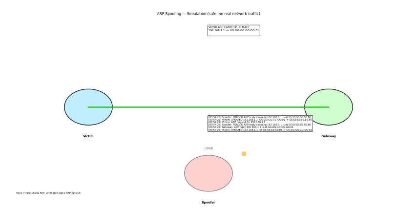
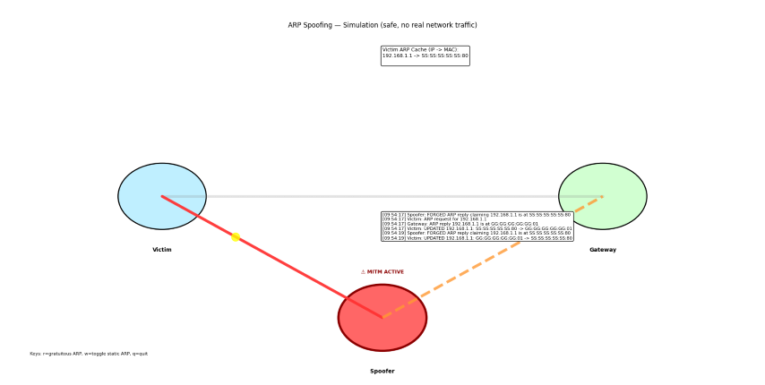

# ARP Spoofing Simulation & Learning Tool 🔒

A **safe, educational simulation** of ARP spoofing attacks and defenses. No root privileges, no real network packets, no risk. Perfect for computer networks courses and cybersecurity education.


---

<!-- Top images: replace these assets/menu.png, assets/sim-1.png, assets/sim-2.png with screenshots -->


<!-- Side-by-side scaled screenshots: use the table below so the images render next to each other and can be resized via the width attribute -->
<table>
	<tr>
		<td></td>
		<td></td>
	</tr>
</table>

## 🎯 What this project demonstrates

- ARP protocol behavior (IP → MAC resolution)
- ARP cache poisoning (MITM) visualization
- Simple defenses: gratuitous ARP and static ARP
- Detection heuristics, logging, and basic auto-defend (in extended mode)

CN-demo — A safe, offline simulation to demonstrate ARP cache poisoning (Man-in-the-Middle) and basic mitigations. Intended for classroom demos and self-study — no real network traffic is sent.

Files kept in this repo:
- `arp_sim.py` — Basic, minimal simulation and demo (single-file, lightweight)
- `arp_sim_extended.py` — Extended demo: detection, logging, statistics, and extra controls
- `run_demo.py` — Helper to launch demos and view docs
- `THEORY.md` — In-depth explanation of ARP, attacks, and mitigations
- `README.md` — This file (overview and quick usage)

Minimum requirements
- Python 3.7+
- matplotlib (pip install matplotlib)

Quick start
```powershell
cd d:\Projects\CN-demo; pip install matplotlib; python run_demo.py
```

Launcher quick reference
- 1 — Basic Simulation (launches `arp_sim.py`) — simple visualization, controls: r (gratuitous ARP), w (toggle static ARP), q (quit)
- 2 — Extended Simulation (launches `arp_sim_extended.py`) — detection, logging, stats; extra controls: d (detection), a (auto-defend), l (logging), e (export)
- 3 — Guided Tutorial — step-by-step learning with explanations and a built-in demo
- 4 — View Documentation — opens `README.md` or `THEORY.md` in your default viewer (or prints to console as fallback)
- 5 — Check Installation — verifies Python version, matplotlib, and required files
- 0 — Exit


## Basic vs Extended modes

- Basic mode (`arp_sim.py`)
	- Single-file, minimal UI. Focuses on the core concept and visual clarity.
	- Controls: r, w, q.
	- No logging, no detection heuristics, and no export features — great for a short classroom walkthrough.

- Extended mode (`arp_sim_extended.py`)
	- Includes detection heuristics, event logging, per-node statistics, and a simple auto-defend mode.
	- Additional controls: d (toggle detection), a (toggle auto-defend), e (export log), l (toggle logging), plus r/w/q from basic.
	- Intended for hands-on labs, student exercises, and exploring defenses in more detail.

What the simulation shows
- Three nodes: Victim, Gateway, Spoofer (attacker)
- Color-coded links: green = correct mapping, red = poisoned (MITM), gray = no mapping
- Animated packet flow to illustrate traffic being routed via the spoofer during poisoning

Notes & safety
- This is a simulation only — it does not transmit packets on your network.
- Do not reuse attack techniques against networks you don't own or have explicit permission to test.

Where to learn more
- See `THEORY.md` for a deeper explanation of ARP, packet formats, attack vectors, and mitigation techniques.

---

Copyright: educational use only
